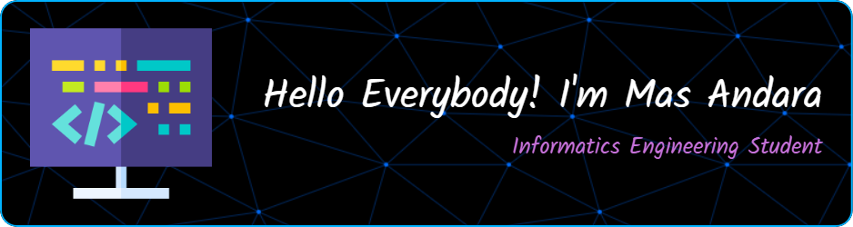

 
<!--
**Masandara/Masandara** is a ✨ _special_ ✨ repository because its `README.md` (this file) appears on your GitHub profile.

Here are some ideas to get you started:
======================= VERSI ENGLISH =============================

- 🔭 I’m currently working on ...
- 🌱 I’m currently learning ...
- 📚 I am currently taking a class on ..
- 👯 I’m looking to collaborate on ...
- 🤔 I’m looking for help with ...
- 💬 Ask me about ...
- 📫 How to reach me: ...
- 😄 Pronouns: ...
- ⚡ Fun fact: ...

======================= VERSI INDONESIA =============================

- 🔭 Saat ini saya sedang mengerjakan ...
- 🌱 Saat ini Saya sedang belajar ...
- 📚 Saat ini saya sedang mengambil kelas tentang ....
- 👯 Saya ingin berkolaborasi di ...
- 🤔 Saya mencari bantuan dengan ...
- 💬 Tanyakan padaku tentang...
- 📫 Cara menghubungi saya: .....
- 😄 Kata ganti: ....
- ⚡ Fakta menarik: ....
  -->

#### About Me

> Active student of Informatics Engineering Study Program Semester 6 at Universitas Duta Bangsa Surakarta, with a concentration in Intelligent Systems. Has a high interest in the development of artificial intelligence-based technology and digital solutions. Experienced in leading youth organizations and developing various web and mobile application projects.

#### My Progress

- 📚 I am currently taking a class on **AI Fluency & AI-900 Azure Fundamental by Microsoft**

#### Skills

              

#### Connect With Me

   

#### Games

   

#### My Stats

   

#### Play games with me

 

